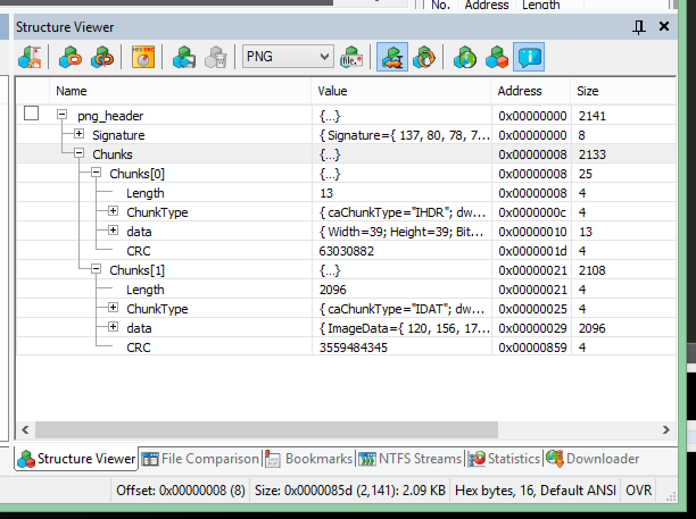
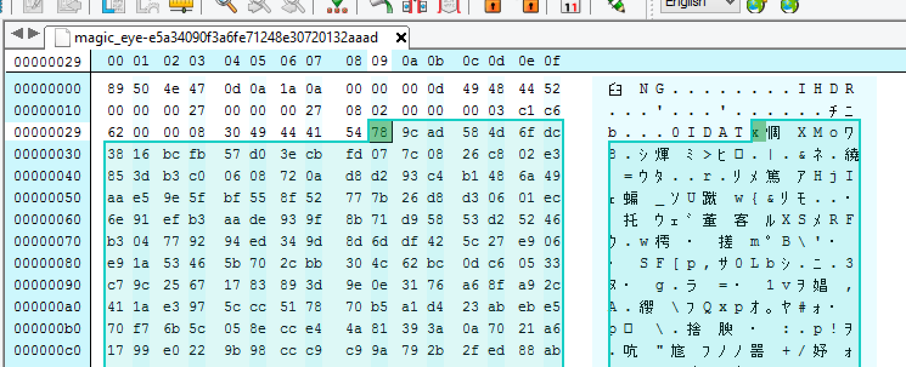

# CTF write-up: defcon23 open CTF No.01 
Challenge | Tags | Point | Author
--- | --- | ---
magic_eye.dat | stego,forensics | 50 | Yen

## English

### Challenge description
magic_eye.dat 50 --- I'm pretty sure it's a schooner - magic_eye-e5a34090f3a6fe71248e30720132aaad 

### write-up
At first I checked the file via file command. Then that file was recognized as a PNG file.
```
jb-mbpr13:magic_eye jetbee$ file magic_eye-e5a34090f3a6fe71248e30720132aaad 
magic_eye-e5a34090f3a6fe71248e30720132aaad: PNG image data, 39 x 39, 8-bit/color RGB, non-interlaced
```

I used string command, but there wasn't any flag suspecious text. 
```
jb-mbpr13:magic_eye jetbee$ strings magic_eye-e5a34090f3a6fe71248e30720132aaad 
IHDR
0IDATx
Rw{&
SF[p,
(snip...)
```

I remembered that the one of this challenge category is 'sutego', so I tried some steganography tools, but I couldn't find any hidding file.

When I gazed the picture again, I realized the last one line of image was unseen.
I doubted it is a transparency image, then I tried to open it with Fireworks to find any track.
Then Fireworks said "Unknown format", and the image wasn't able to open.

For that I realize some. The data of the image may be broken or something other format.

I opened the image file with Hex Editor Neo that can recognize png format. There was no IEND chunk in it.

[PNG file format](http://www.w3.org/TR/PNG/#4Concepts.Format)

I thought IHDR chunk is correct, because file command recognized that file as png. I thought IDAT chunk was suspicious.
I pull out the data section of IDAT chunk and saved it as a new file with Hex Editor Neo.

I checked it with file command, but there was no information then.
```
jb-mbpr13:magic_eye jetbee$ file IDAT_data.dat 
IDAT_data.dat: data
```

I checked PNG file format documents, it saied image data of png file is compressed with zlib. Then I tried to decompress it.
[zlib compression](http://www.w3.org/TR/PNG/#10Compression)

I made a tiny python script and decompressed it. In the end I got the key.

```
jb-mbpr13:magic_eye jetbee$ cat magic_eye.py 
import zlib
compressed = open('IDAT_data.dat', 'rb').read()
decompressed = zlib.decompress(compressed)
f = open('decompressed', 'wb')
f.write(decompressed)
f.close()

jb-mbpr13:magic_eye jetbee$ python magic_eye.py
jb-mbpr13:magic_eye jetbee$ cat decompressed 
It is a truth universally acknowledged, that a single man in possession of a good fortune, must be in want of a wife.
(...snip...)
temper. When she was discontented, she fancied herself nervous. The business of her life was to get her daughters married; its solace was visiting and news.

BTW the flag is some_flag_goes_here

                                                                                   jb-mbpr13:magic_eye jetbee$ 
```

---

## 日本語 (Japanese)

### 問題文
magic_eye.dat 50 --- I'm pretty sure it's a schooner - magic_eye-e5a34090f3a6fe71248e30720132aaad 

### 翻訳
それはスクーナーだと確信します！

### write-up
fileコマンドで確認したところ、PNGファイルと判定されました。
```
jb-mbpr13:magic_eye jetbee$ file magic_eye-e5a34090f3a6fe71248e30720132aaad 
magic_eye-e5a34090f3a6fe71248e30720132aaad: PNG image data, 39 x 39, 8-bit/color RGB, non-interlaced
```

stringsコマンドなどでも特にFlagになりそうなテキストは含まれていません。
```
jb-mbpr13:magic_eye jetbee$ strings magic_eye-e5a34090f3a6fe71248e30720132aaad 
IHDR
0IDATx
Rw{&
SF[p,
〜以下省略〜
```

カテゴリに、sutego とあることから、ステガノグラフィーだと予想をたてました。
そして、複数のステガノグラフィーのツールを試しましたが、特にファイルが埋め込まれているなどは発見できませんでした。

もう一度、画像をよく眺めていると、画像の一番下の１ピクセル分の行が表示されていないことに気が付きました。
透過レイヤーでこの行は背景のみなのかもと思い、何か手がかりを求めて、Fireworksで開いて確認しようとしました。
すると、「不明な画像形式」というエラーが出て開けませんでした。

ここで閃きました。一見、プレビューでは画像のように見えているけど、データ自体は壊れていて、画像データ部分はなにか別のデータなのかもしれません。

PNGの構造が見れるバイナリエディタの、Hex Editor Neo で開いて、PNGのファイルフォーマットを確認していたところ、IENDチャンクがありませんでした。

[PNGデータ構造](http://www.w3.org/TR/PNG/#4Concepts.Format)

IHDRチャンクはfileコマンドでもしっかり認識されている情報が入っていることから、IDATチャンクのデータが怪しいと考えました。
Hex Editor Neo にて、IDATチャンクのデータ部分のみを抜き出し、別ファイルとして保存。

fileコマンドで確かめますが、すぐには何のデータかはわかりません。
```
jb-mbpr13:magic_eye jetbee$ file IDAT_data.dat 
IDAT_data.dat: data
```
PNGのファイルフォーマットを再び確認したところ、IDATのdata部分は、zlibで圧縮されているとのことで、解凍を試みました。
[IDATのdataはzlib圧縮](http://www.w3.org/TR/PNG/#10Compression)
簡単なpythonスクリプトで解凍したところ無事キーが表示され正解となりました。

```
jb-mbpr13:magic_eye jetbee$ cat magic_eye.py 
import zlib
compressed = open('IDAT_data.dat', 'rb').read()
decompressed = zlib.decompress(compressed)
f = open('decompressed', 'wb')
f.write(decompressed)
f.close()

jb-mbpr13:magic_eye jetbee$ python magic_eye.py
jb-mbpr13:magic_eye jetbee$ cat decompressed 
It is a truth universally acknowledged, that a single man in possession of a good fortune, must be in want of a wife.
〜中略〜
temper. When she was discontented, she fancied herself nervous. The business of her life was to get her daughters married; its solace was visiting and news.

BTW the flag is some_flag_goes_here

                                                                                   jb-mbpr13:magic_eye jetbee$ 
```
