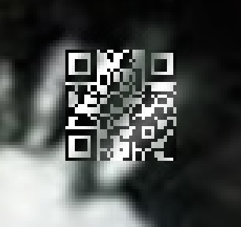

# CTF write-up: defcon23 open CTF No.03
Challenge | Tags | Point | Author
--- | --- | ---
Enhance | misc,forensics,CSI | 50 | Nodus

## English

### Challenge description
Enhance 50 --- We think this woman might be a license dodger - can you find out where she's hiding? 172.16.18.20/enhance-50e7818433c4e832e0e96e91dc4cb64c

### write-up
First, file command you already know. It was jpeg.
```
jb-mbpr13:Enhance jetbee$ file enhance
enhance: cannot open `enhance' (No such file or directory)
jb-mbpr13:Enhance jetbee$ file enhance-50e7818433c4e832e0e96e91dc4cb64c
enhance-50e7818433c4e832e0e96e91dc4cb64c: JPEG image data, JFIF standard 1.01
```

When I did strings, Then I found RDF formated strings and letter 'good luck'.
```
jb-mbpr13:Enhance jetbee$ strings enhance-50e7818433c4e832e0e96e91dc4cb64c
JFIF
*$Exif
NIKON CORPORATION
NIKON D3000
GIMP 2.8.14
2015:07:23 01:41:16
0230
0100
2009:08:08 11:54:13
2009:08:08 11:54:13
ASCII
                                    
1046F3F3643F4DADBF3D5272D60BB17F
JFIF
 $.' ",#
(...snip...)
u6-wr
Jw9f
good luck
http://ns.adobe.com/xap/1.0/
<?xpacket begin='
' id='W5M0MpCehiHzreSzNTczkc9d'?>
<x:xmpmeta xmlns:x='adobe:ns:meta/'>
<rdf:RDF xmlns:rdf='http://www.w3.org/1999/02/22-rdf-syntax-ns#'>
 <rdf:Description xmlns:exif='http://ns.adobe.com/exif/1.0/'>
  <exif:ImageWidth>3872</exif:ImageWidth>
  <exif:ImageLength>2592</exif:ImageLength>
  <exif:BitsPerSample>8, 8, 8</exif:BitsPerSample>
  <exif:PhotometricInterpretation>RGB</exif:PhotometricInterpretation>
  <exif:Make>NIKON CORPORATION</exif:Make>
  <exif:Model>NIKON D3000</exif:Model>
  <exif:Orientation>Top-left</exif:Orientation>
(...snip...)
```

In addition, there was JFIF header. I found another jpeg image in it.
It was the thumbnail.

I had been investigating the exif part for longtime.
When I thought about challange title well, I found Enhance meaned high resolution!
I wonder if I would zoom in the image, there would be a key or something on it.

Then I zoomed in the image and investigated it, there was a QR code in her eye.



Croping it, adjusting contrust and reading with a QR code reader Andoroid App.

```
Ju5tPr1ntTheDAmNTh1n6
```
This is it.

Title is important.

---

## 日本語 (Japanese)

### 問題文
Enhance 50 --- We think this woman might be a license dodger - can you find out where she's hiding? 172.16.18.20/enhance-50e7818433c4e832e0e96e91dc4cb64c

### 翻訳
この女性は、ライセンス違反者のはずだと考えています。どこに彼女が隠れているか見つけられますか？

### write-up
まずはfileコマンドで確認。jpeg。
```
jb-mbpr13:Enhance jetbee$ file enhance
enhance: cannot open `enhance' (No such file or directory)
jb-mbpr13:Enhance jetbee$ file enhance-50e7818433c4e832e0e96e91dc4cb64c
enhance-50e7818433c4e832e0e96e91dc4cb64c: JPEG image data, JFIF standard 1.01
```

stringsコマンドでRDFフォーマットと good luckの文字が見つかります。
```
jb-mbpr13:Enhance jetbee$ strings enhance-50e7818433c4e832e0e96e91dc4cb64c
JFIF
*$Exif
NIKON CORPORATION
NIKON D3000
GIMP 2.8.14
2015:07:23 01:41:16
0230
0100
2009:08:08 11:54:13
2009:08:08 11:54:13
ASCII
                                    
1046F3F3643F4DADBF3D5272D60BB17F
JFIF
 $.' ",#
(...snip...)
u6-wr
Jw9f
good luck
http://ns.adobe.com/xap/1.0/
<?xpacket begin='
' id='W5M0MpCehiHzreSzNTczkc9d'?>
<x:xmpmeta xmlns:x='adobe:ns:meta/'>
<rdf:RDF xmlns:rdf='http://www.w3.org/1999/02/22-rdf-syntax-ns#'>
 <rdf:Description xmlns:exif='http://ns.adobe.com/exif/1.0/'>
  <exif:ImageWidth>3872</exif:ImageWidth>
  <exif:ImageLength>2592</exif:ImageLength>
  <exif:BitsPerSample>8, 8, 8</exif:BitsPerSample>
  <exif:PhotometricInterpretation>RGB</exif:PhotometricInterpretation>
  <exif:Make>NIKON CORPORATION</exif:Make>
  <exif:Model>NIKON D3000</exif:Model>
  <exif:Orientation>Top-left</exif:Orientation>
(...snip...)
```

更に、JFIFヘッダでJPEG画像がもう一個入っているのもわかります。
これはサムネイル画像でした。

ずっとExifを追いかけてしまったのですが、問題名をよく考えると、Enhance = 解像度 ということで、ひょっとしてすごく解像度を上げる（拡大）すると画像のどこかにそのままキーがどこかに隠れているのではと閃きます。

なんと、拡大して見ていくとその通りで、目の中にQRコードらしきものが。


周囲を切り抜いて、コントラストを調整して、Andoroidアプリのバーコードリーダーで読み取りました。

```
Ju5tPr1ntTheDAmNTh1n6
```
無事flagが取れました！

問題名って大事ですね。
